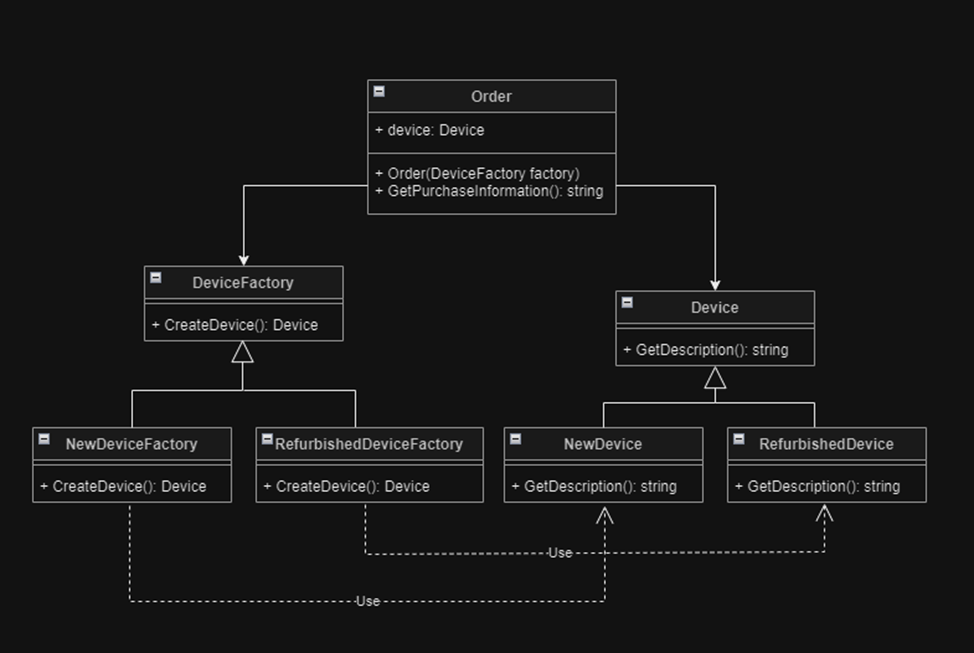
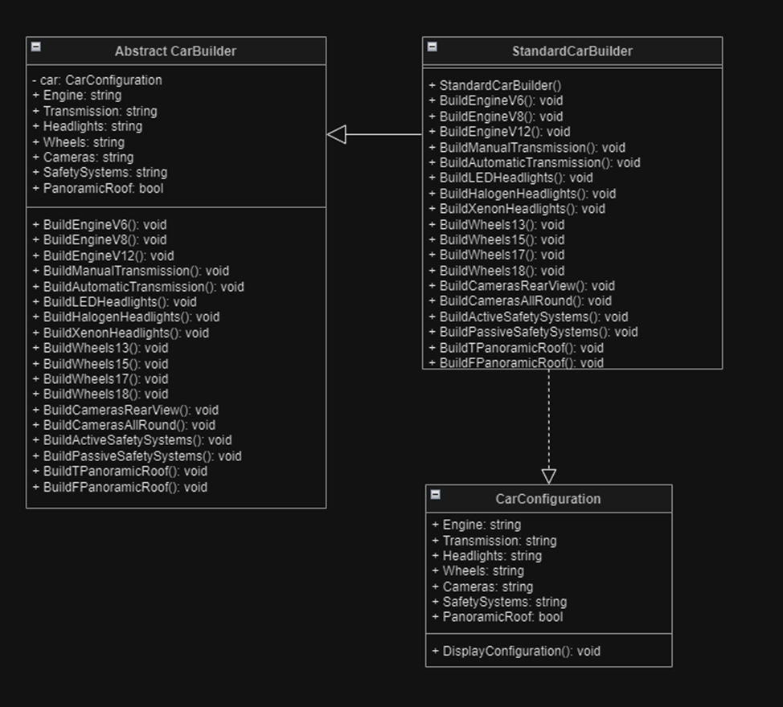
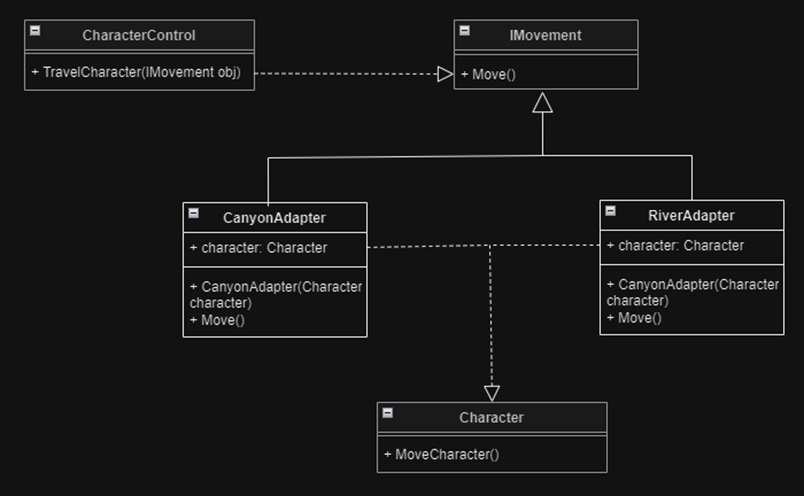
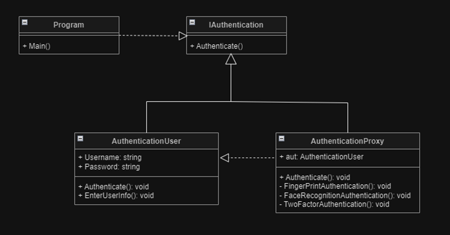

# MIKS

| Variant       | IDE                | Programming language | Database |
| ------------- | ------------------ | -------------------- | -------- |
| 8             | Visual Studio      | C#                   |  MySql   |

Lab 2_1 UML Abstract Factory Pattern:

Lab 2_2 UML Builder Pattern:

Lab 3_1 UML Adapter Pattern:

Lab 3_2 UML Proxy Pattern:
